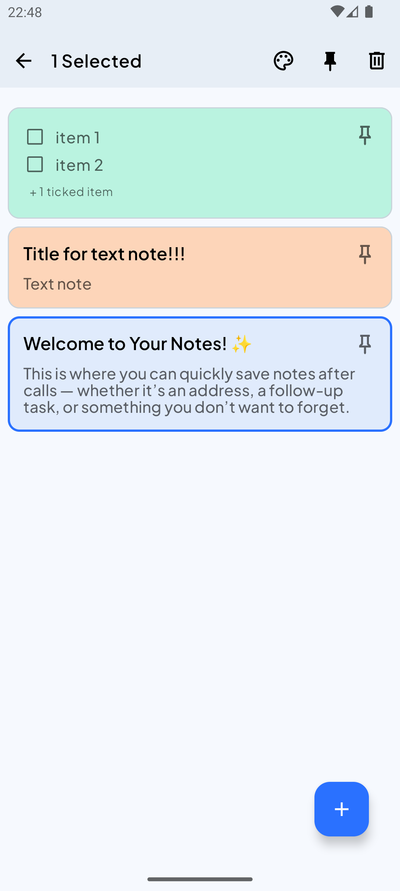

# Notes Master

**Notes Master** began as an MVP project built under tight deadlines.
It’s now undergoing a major **refactor and modernization**, with the following goals:

### Current Objectives

1. Modularize the codebase.
2. Migrate to **Kotlin Multiplatform**.
3. Add support for **voice recordings** in notes.
4. Implement **voice transcription** functionality.

> This transformation aims to make the app scalable, maintainable, and more feature-rich across platforms.

### 🎬 Preview

[Short example]([demo/demo_video.webm](https://github.com/user-attachments/assets/4b05c860-702f-4d45-be01-1f5e545b35e1))
