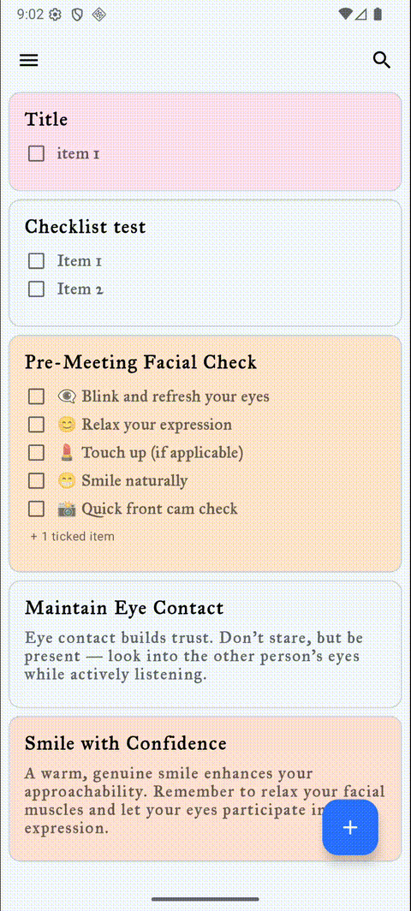
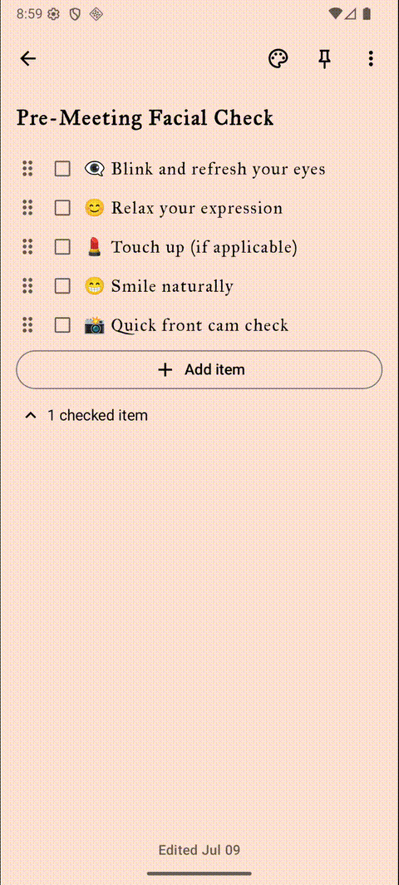
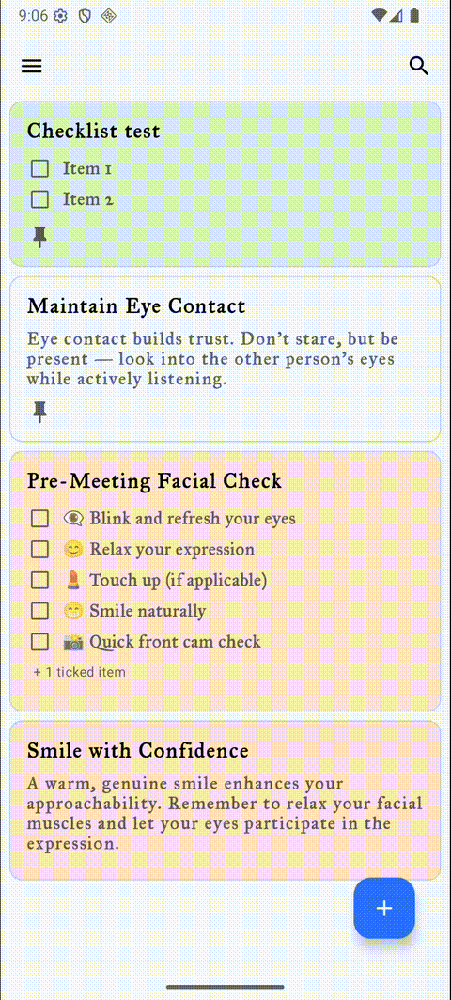
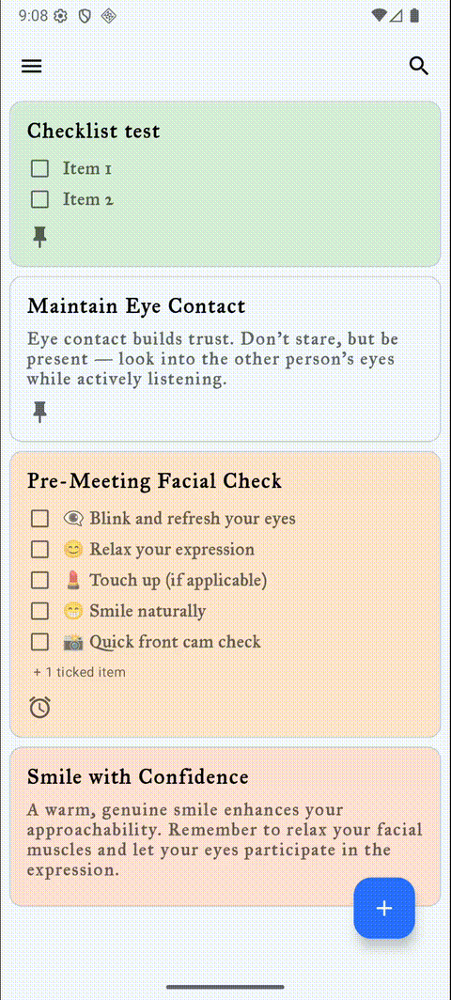
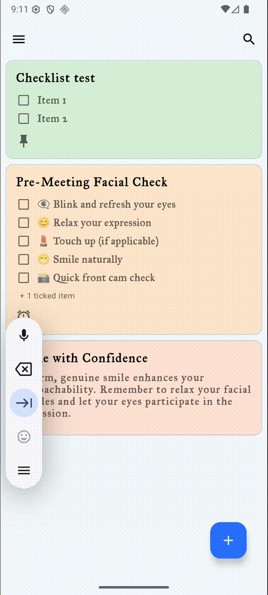
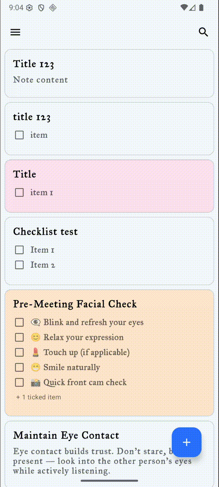

# Notes Master

**Notes Master** is a powerful, modern note-taking app that supports rich features for productivity and organization.

Originally developed as an MVP under tight deadlines, the app is currently undergoing a major **refactor and modernization**,
including a **Kotlin Multiplatform** migration. The goal is to deliver a maintainable, scalable, and cross-platform experience.

---

## ✨ Features

- 📝 **Two Types of Notes**
    - **Text Notes** – Write and edit plain text.
    - **Checklist Notes** – Create, reorder, edit, check/uncheck, and delete checklist items.

    

- 🎨 **Custom Background Colors**
    - Change background color for each note for better organization and visual clarity.

    

- ⏰ **Reminders**
    - Schedule notifications to remind yourself of important notes.
    
    

- 📤 **Sharing**
    - Share notes as plain text or export them as **PDF**.

    

- 🗑️ **Trash Bin**
    - Deleted notes go to Trash and are retained for **7 days** before permanent removal.

    

- 📋 **Main Screen Note Management**
    - View all notes in one place.
    - Perform group actions: **Pin**, **Change Color**, or **Delete** multiple notes at once.

    

- 🌙 **Themes**
    - Supports **Light**, **Dark**, and **System Default** themes.

    

---

## 🛠️ Current Objectives

- Modularize the codebase.
- Migrate to **Kotlin Multiplatform** for future iOS/Desktop/Web support.
- Add **voice recording support** in notes.
- Implement **voice transcription** for faster note entry.

> This transformation aims to make the app scalable, maintainable, and more feature-rich across platforms.

---

## 📦 Tech Stack

- **Kotlin**
- **Jetpack Compose**
- **Kotlin Multiplatform**
- **MVVM architecture**

---

## 📄 License

[MIT License](./LICENSE)